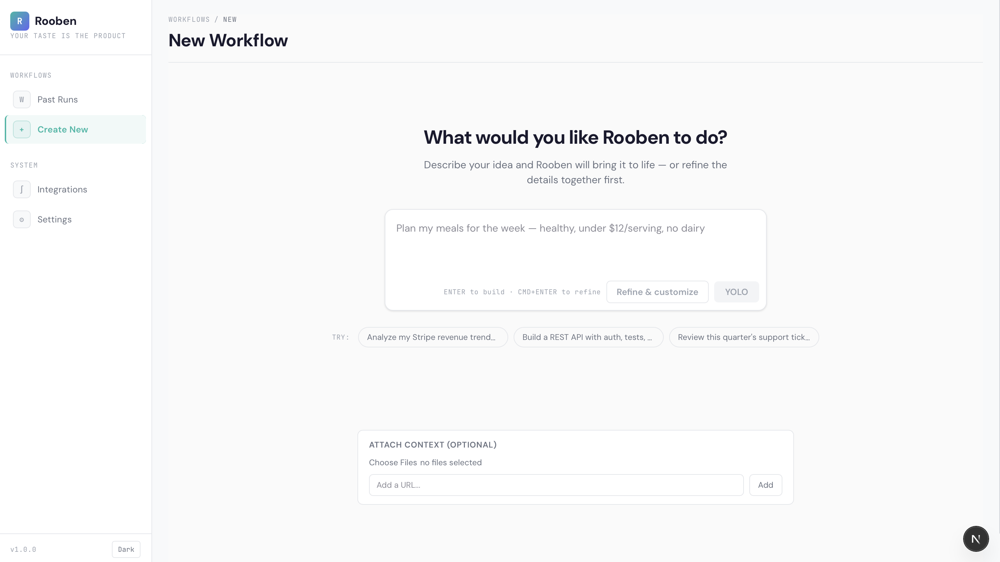
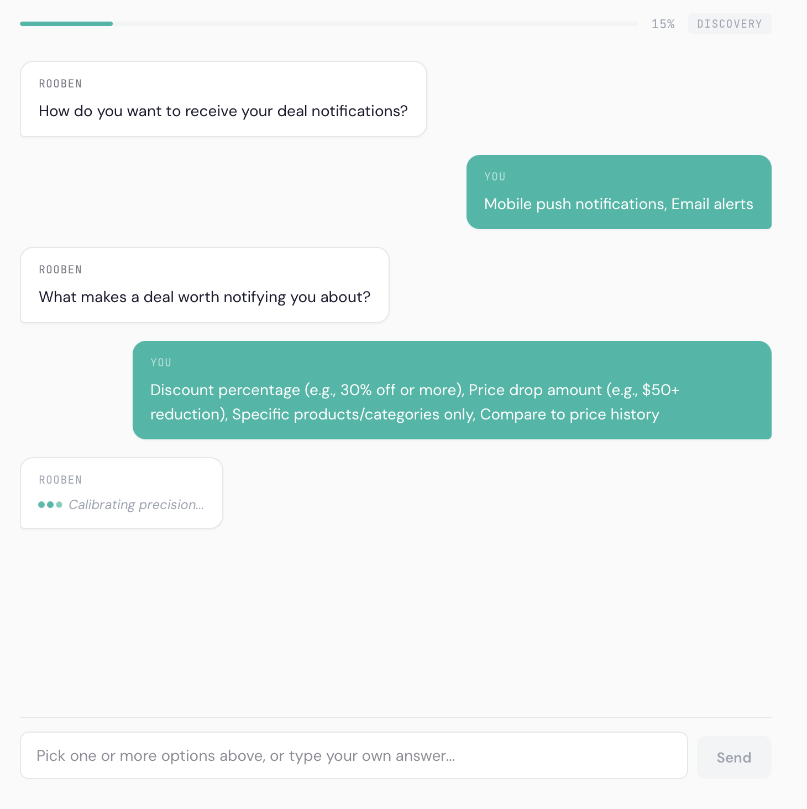
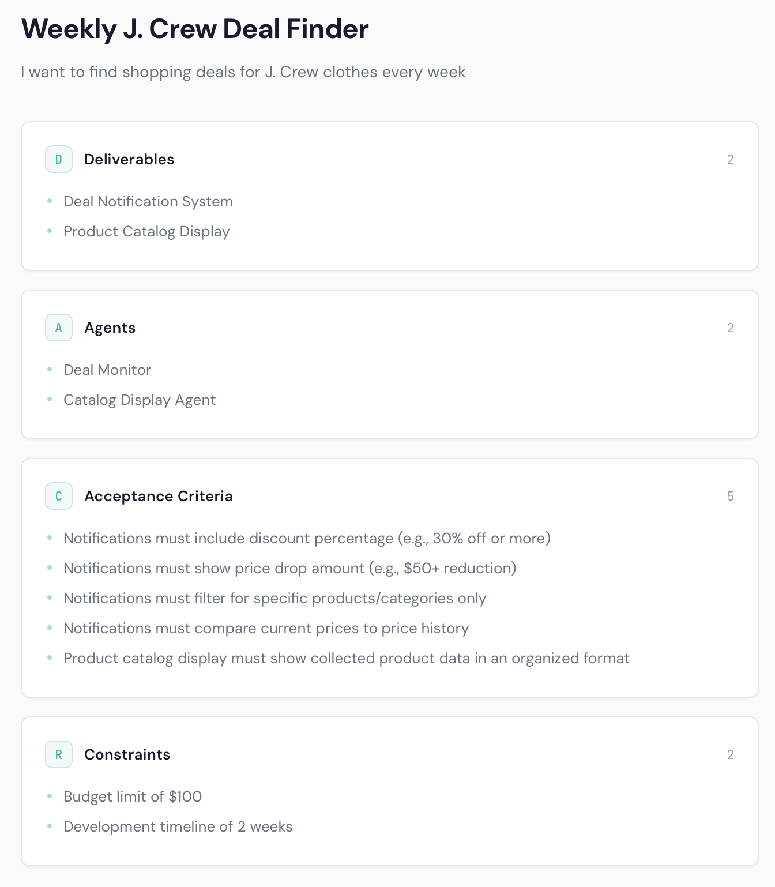
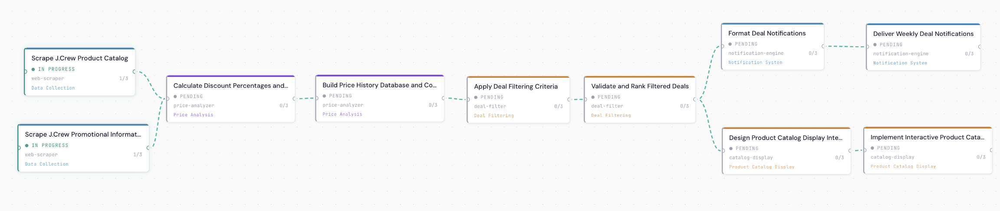
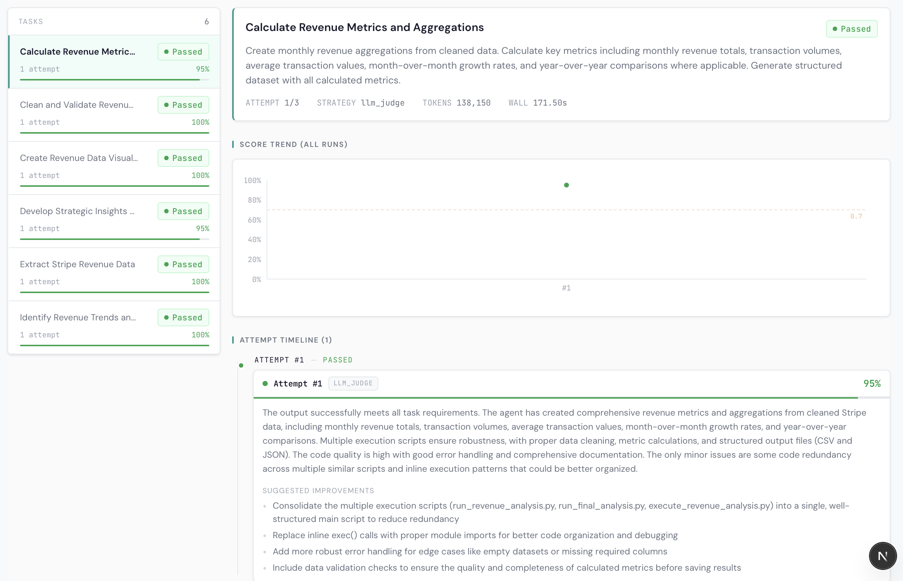
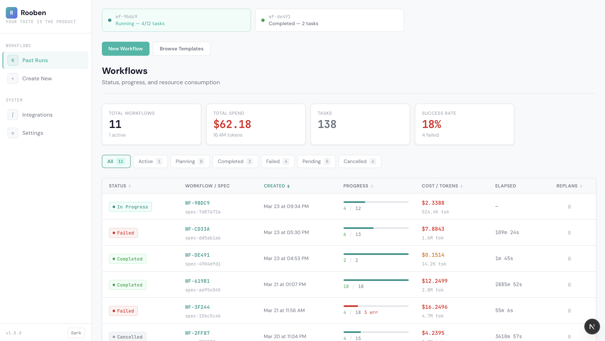
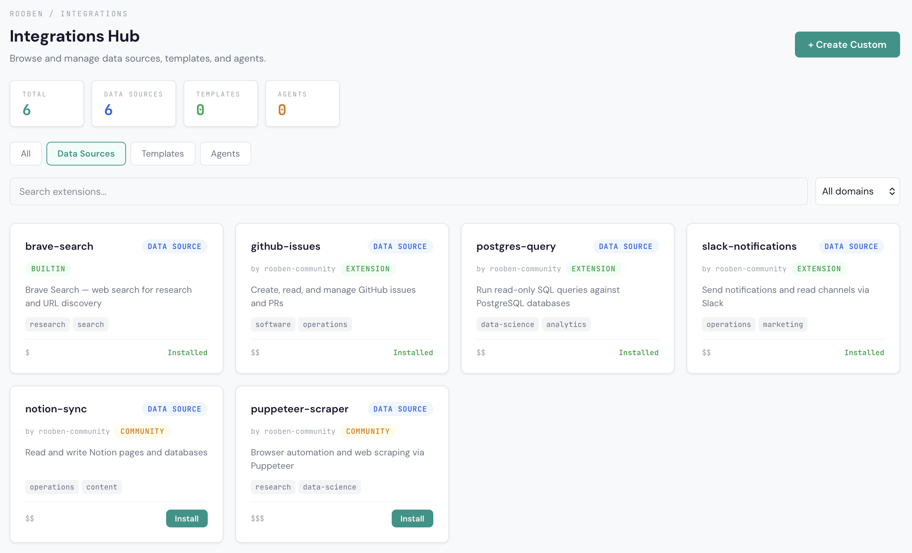
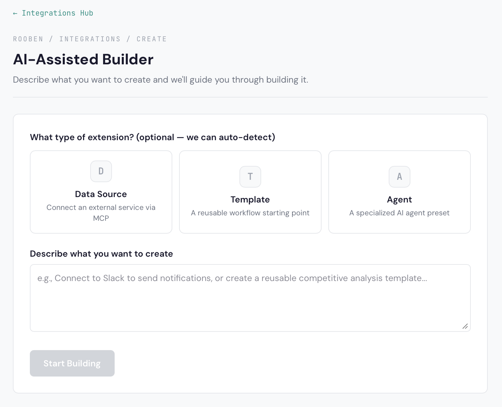
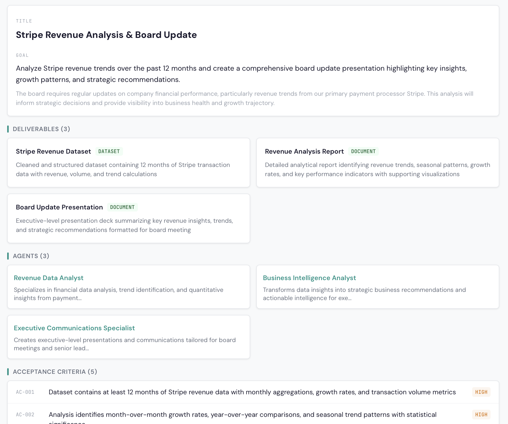
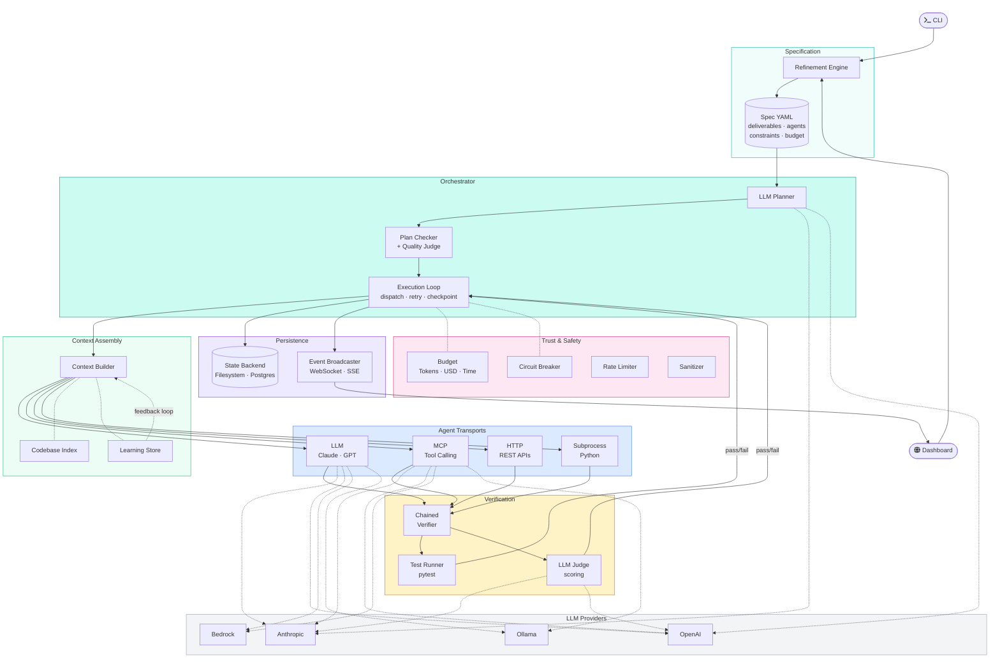

<p align="center">
  <a href="https://cdn.predicate.ventures/demo.mp4">
    
  </a>
  <br />
  <em>Click to watch the demo</em>
</p>

<p align="center">
  <a href="https://pypi.org/project/rooben/"></a>
  <a href="https://github.com/blakeaber/rooben/actions"></a>
  <a href="https://github.com/blakeaber/rooben/blob/main/LICENSE"></a>
  
  <a href="https://github.com/blakeaber/rooben/stargazers"></a>
</p>

---

Rooben turns plain English into verified, multi-agent work product. Describe what you want. Rooben builds the plan, assembles specialized AI agents, executes in parallel, verifies every output, tracks every dollar, and delivers the result.

It's the difference between asking one AI for help and deploying a coordinated team that shows its work.

## The workflow

<table>
<tr>
<td width="50%" align="center">

<br /><b>1. Describe what you want</b><br />
Plain English or pick a template — attach files for context
</td>
<td width="50%" align="center">

<br /><b>2. Refine interactively</b><br />
Rooben asks clarifying questions to build your specification
</td>
</tr>
<tr>
<td width="50%" align="center">

<br /><b>3. Review the specification</b><br />
Deliverables, agents, acceptance criteria, and budget — before execution
</td>
<td width="50%" align="center">

<br /><b>4. Watch agents execute</b><br />
Live DAG visualization — parallel tasks with dependency tracking
</td>
</tr>
<tr>
<td width="50%" align="center">

<br /><b>5. Verified results</b><br />
Every output scored by test runner + LLM judge with detailed feedback
</td>
<td width="50%" align="center">

<br /><b>6. Track everything</b><br />
Cost, tokens, success rate, and history across all workflows
</td>
</tr>
</table>

<details>
<summary><b>More screenshots</b> — Integrations Hub, AI-Assisted Builder, Revenue Analysis Specification</summary>
<br />
<table>
<tr>
<td width="50%" align="center">

<br /><b>Integrations Hub</b> — Browse data sources, templates, and agents
</td>
<td width="50%" align="center">

<br /><b>AI-Assisted Builder</b> — Create custom extensions through conversation
</td>
</tr>
<tr>
<td width="50%" colspan="2" align="center">

<br /><b>Generated Specification</b> — "Analyze our quarterly revenue trends and draft a board update"
</td>
</tr>
</table>
</details>

---

## See it work (30 seconds, no API key)

```bash
pip install rooben
rooben demo
```

This runs a full orchestration with mock providers — planning, multi-agent execution, verification, budget enforcement — so you can see the framework in action without spending a cent.

## Real usage

```bash
# Quick start — describe what you want, Rooben handles the rest
rooben go "Build a REST API for managing books with tests"

# Interactive spec authoring — Rooben interviews you about your project
rooben refine

# Run a specification file
export ANTHROPIC_API_KEY="sk-ant-..."
rooben run examples/hello_api.yaml
```

## How it works

```
 "Build a competitive analysis     ┌─────────────────────┐
  of Stripe vs Square for          │  Interactive Refine  │   Rooben asks 2-3
  our board presentation"   ──────▶│  Spec-as-Contract    │   clarifying questions
                                   └──────────┬──────────┘
                                              │
                                   ┌──────────▼──────────┐
                                   │    LLM Planner      │   Decomposes into
                                   │    (DAG of tasks)   │   workstreams + tasks
                                   └──────────┬──────────┘
                                              │
                              ┌───────────────┼───────────────┐
                              ▼               ▼               ▼
                        ┌──────────┐   ┌──────────┐   ┌──────────┐
                        │ Agent A  │   │ Agent B  │   │ Agent C  │   Parallel
                        │ Research │   │ Analyze  │   │ Draft    │   execution
                        └────┬─────┘   └────┬─────┘   └────┬─────┘
                             └───────────────┼───────────────┘
                                             ▼
                                   ┌─────────────────┐
                                   │   Verification   │   Test runner +
                                   │   (chained)      │   LLM judge scoring
                                   └────────┬────────┘
                                            ▼
                                   ✅ Verified result
                                   💰 Total cost: $0.37
                                   📊 4/4 criteria passed
```

Every workflow follows this pattern: **plan → execute → verify → deliver**. You see the plan before it runs. You watch agents work in real time. You get proof, not promises.

## The dashboard

Rooben ships with a web dashboard for visual workflow management:

- **Live DAG monitoring** — watch tasks execute, see dependencies, track progress
- **Verification display** — green checks with scores and detailed feedback
- **Cost analytics** — per-model, per-agent, per-workflow cost breakdowns
- **Extension hub** — browse and install integrations, templates, and agents

```bash
# Launch the dashboard
pip install rooben[dashboard]
rooben dashboard
```

## Why Rooben?

Every AI tool can generate text. Only Rooben shows the plan, proves the work, and tracks the cost.

| Capability | ChatGPT | Cursor | Zapier | CrewAI | Dify | **Rooben** |
|---|:---:|:---:|:---:|:---:|:---:|:---:|
| Plain-English input | ✓ | ✓ | ✓ | — | ✓ | **✓** |
| Multi-agent orchestration | — | ✓ | — | ✓ | ~ | **✓** |
| **Verified output with scoring** | — | — | — | ~ | — | **✓** |
| **Per-workflow budget enforcement** | — | — | — | — | — | **✓** |
| **Spec-as-contract before execution** | — | — | — | — | — | **✓** |
| Cross-domain (code + docs + research) | chat | code | ✓ | ✓ | ✓ | **✓** |
| Live execution monitoring | — | — | — | — | — | **✓** |

✓ = shipped  ~ = partial  — = not available

## Features

### Core engine
- **Spec-driven orchestration** — validated YAML/JSON specs decomposed into DAGs of concurrent tasks
- **Multi-agent execution** — fan-out/fan-in with concurrency controls and circuit breakers
- **Chained verification** — test runner + LLM judge with structured feedback loops and retry
- **Budget enforcement** — hard limits on tokens, USD, wall-time, and concurrent agents
- **Cost tracking** — per-call pricing for Anthropic, OpenAI, Bedrock, and Ollama models
- **Credential sanitization** — automatic redaction of API keys, passwords, and tokens

### Agent transports

| Transport | Use case |
|-----------|----------|
| **LLM** | Claude, GPT-4o, and other LLMs with tool-calling |
| **MCP** | Model Context Protocol servers with agentic tool loop |
| **HTTP** | Delegate to any REST API |
| **Subprocess** | Run Python callables in isolated processes |

### Providers

| Provider | Install |
|----------|---------|
| Anthropic (Claude) | Built-in |
| OpenAI (GPT-4o, o1) | `pip install rooben[openai]` |
| AWS Bedrock | `pip install rooben[bedrock]` |
| Ollama (local models) | Built-in |

### Extensions

Rooben ships with **17 bundled extensions** and a plugin system for community contributions:

**Templates** — Sales pipeline report, competitive analysis, research report, client briefing, REST API, CLI tool, data pipeline, React dashboard, weekly report, competitive monitor, data quality check

**Integrations** — Slack notifications, GitHub Issues, PostgreSQL queries

**Agents** — Code reviewer, research analyst, data engineer

```bash
# Browse available extensions
rooben extensions list

# Install a community extension
pip install rooben-ext-slack

```

Extensions are pip-installable Python packages using standard entry points — the same pattern as pytest and Flask plugins.

## Specifications

A specification is the contract between you and your AI team. It describes *what* to build, *how* to verify success, and *who* does the work:

```yaml
id: "spec-board-deck"
title: "Competitive Analysis for Board Presentation"

goal: |
  Research Stripe, Square, and Adyen across pricing, features,
  market share, and developer experience. Produce a structured
  analysis with data sources cited.

deliverables:
  - id: "D-001"
    name: "Competitive Matrix"
    deliverable_type: "document"
    description: "Side-by-side comparison across 8 dimensions"
    acceptance_criteria_ids: ["AC-001", "AC-002"]

success_criteria:
  acceptance_criteria:
    - id: "AC-001"
      description: "All claims include data sources"
      verification: "llm_judge"
      priority: "critical"
  completion_threshold: 0.85

agents:
  - id: "researcher"
    name: "Market Researcher"
    transport: "mcp"
    capabilities: ["research", "web-search"]
    mcp_servers:
      - name: "brave-search"
        transport_type: "stdio"
        command: "npx"
        args: ["-y", "@anthropic/brave-search-mcp"]

global_budget:
  max_total_tasks: 15
  max_concurrent_agents: 4
  max_wall_seconds: 300
```

Or skip the YAML entirely — `rooben refine` builds specs through conversation, and `rooben go` generates them from a single sentence.

## Programmatic usage

```python
import asyncio
from rooben.spec.loader import load_spec
from rooben.planning.llm_planner import LLMPlanner
from rooben.planning.provider import AnthropicProvider
from rooben.agents.registry import AgentRegistry
from rooben.orchestrator import Orchestrator
from rooben.state.filesystem import FilesystemBackend
from rooben.verification.llm_judge import LLMJudgeVerifier
from rooben.context.builder import ContextBuilder
from rooben.billing.costs import CostRegistry

async def main():
    spec = load_spec("examples/hello_api.yaml")
    provider = AnthropicProvider(model="claude-sonnet-4-20250514")

    orchestrator = Orchestrator(
        planner=LLMPlanner(provider=provider),
        agent_registry=AgentRegistry(llm_provider=provider),
        backend=FilesystemBackend(base_dir=".rooben/state"),
        verifier=LLMJudgeVerifier(provider=provider),
        budget=spec.global_budget,
        context_builder=ContextBuilder(max_tokens=4000),
        cost_registry=CostRegistry(),
    )

    state = await orchestrator.run(spec)
    for task in state.tasks.values():
        print(f"[{task.status.value}] {task.title}")

asyncio.run(main())
```

Rooben exposes a clean SDK with six protocols you can implement to extend the system:

```python
from rooben import (
    LLMProvider,        # Plug in any LLM backend
    StateBackend,       # Plug in any persistence layer
    Verifier,           # Plug in any verification strategy
    Planner,            # Plug in any task decomposition
    AgentProtocol,      # Plug in any agent execution backend
)
```

## Examples

| Example | What it demonstrates |
|---------|---------------------|
| [`hello_api.yaml`](examples/hello_api.yaml) | Simple REST API — 2 agents, dependency chains, mixed verification |
| [`realtime_dashboard.yaml`](examples/realtime_dashboard.yaml) | Complex DAG — 9 deliverables, 4 agents, 5-level deep dependencies |
| [`job_matcher.yaml`](examples/job_matcher.yaml) | Service pipeline — 4 standalone services, complex agent routing |
| [`demo_orchestration.py`](examples/demo_orchestration.py) | Full feature demo with mock providers (no API key needed) |

## Installation

```bash
# Core
pip install rooben

# With specific providers
pip install "rooben[openai]"       # OpenAI support
pip install "rooben[bedrock]"      # AWS Bedrock support
pip install "rooben[mcp]"          # MCP agent support
pip install "rooben[dashboard]"    # Web dashboard

# Everything (development)
pip install "rooben[dev]"
```

Requires **Python 3.11+**.

## Architecture



```
src/rooben/
├── orchestrator.py          # Central execution engine
├── cli.py                   # CLI interface (go, run, refine, demo)
├── public_api.py            # SDK protocols and exports
├── agents/                  # LLM, MCP, HTTP, subprocess transports
│   ├── protocol.py          # AgentProtocol interface
│   ├── registry.py          # Agent lifecycle + concurrency control
│   └── integrations.py      # MCP server registry + credential resolution
├── planning/                # Spec → DAG decomposition
│   ├── llm_planner.py       # LLM-based plan generation
│   ├── checker.py           # Deterministic plan validation (10 checks)
│   └── plan_judge.py        # LLM-based plan quality scoring
├── verification/            # Output verification pipeline
│   ├── llm_judge.py         # Acceptance criteria scoring
│   ├── test_runner.py       # pytest execution in isolation
│   └── verifier.py          # Chained multi-strategy verifier
├── refinement/              # Interactive spec authoring (Q&A loop)
├── context/                 # Priority-ordered prompt assembly
│   ├── builder.py           # Budget-aware context construction
│   └── codebase_index.py    # Project file indexing
├── extensions/              # Plugin system (entry-point discovery)
│   ├── protocols.py         # 7 extension protocols
│   ├── manifest.py          # Extension manifest schema
│   └── loader.py            # Tier 1 + installed extension loading
├── memory/                  # Cross-run learning persistence
├── resilience/              # Circuit breaker, checkpointing
├── security/                # Budget enforcement, rate limiting, sanitization
├── billing/                 # Per-model cost tracking
├── state/                   # Filesystem + PostgreSQL backends
├── spec/                    # Specification models + validation
├── observability/           # Workflow reporting and diagnostics
└── dashboard/               # FastAPI web dashboard + real-time events
```

## Testing

```bash
# Run all tests
python -m pytest tests/ -v

# Run with timeout (CI mode)
python -m pytest tests/ -v --timeout=60

# Lint
ruff check src/ tests/
```

## Roadmap

We build in public. See the [full roadmap](https://rooben.predicate.ventures/roadmap) for what's coming next and [why we built this](https://rooben.predicate.ventures/why) for the story behind Rooben.

**What's here today:**
- Spec-driven multi-agent orchestration with 4 providers
- Chained verification (test runner + LLM judge)
- Per-workflow budget enforcement and cost tracking
- Extension system with 17 bundled extensions
- Web dashboard with live DAG monitoring
- MCP toolkit integration with 10 built-in toolkits

## Contributing

We welcome contributions. See [CONTRIBUTING.md](CONTRIBUTING.md) for setup instructions, code style, and PR process.

```bash
# Development setup
git clone https://github.com/blakeaber/rooben.git
cd rooben
pip install -e ".[dev]"
python -m pytest tests/ -v
```

## License

[Apache-2.0](LICENSE) — Copyright (c) 2024 Blake Aber
